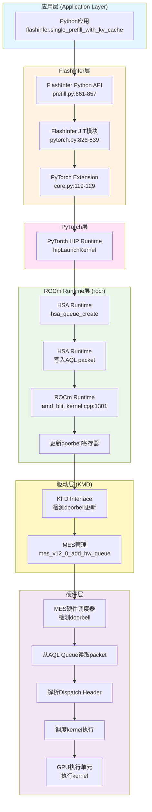

# AI Kernel Submission 流程详解

**文档类型**: 技术文档  
**创建时间**: 2025-01-XX  
**目的**: 详细描述ROCm/HIP环境下AI kernel从应用层到硬件执行的完整提交流程  
**参考文档**: 基于`/mnt/md0/zhehan/code/rampup_doc/2PORC_profiling`中的DRIVER_xx系列分析文档

---

## 执行摘要

本文档详细描述了ROCm/HIP环境下AI kernel（特别是FlashInfer等AI框架）的完整提交流程。关键发现：

1. **90%的kernel提交使用doorbell机制**，不经过驱动层的Ring
2. **MES (Micro-Engine Scheduler)是硬件调度器**，kernel提交直接通过doorbell
3. **AQL Queue是用户空间队列**，通过doorbell通知硬件
4. **驱动层Ring主要用于SDMA操作**，Compute kernel不经过驱动层Ring

---

## 完整调用栈（10层架构）

### 流程图



### 详细调用栈

```
┌─────────────────────────────────────────────────────────────────────────┐
│ 第1层: Python应用层                                                      │
├─────────────────────────────────────────────────────────────────────────┤
│ 文件: qwen2_single_prefill.py:416                                        │
│ 代码: flashinfer.single_prefill_with_kv_cache(q, k, v, causal=True, ...) │
│ 说明: 用户调用FlashInfer的Python API                                     │
└─────────────────────────────────────────────────────────────────────────┘
                              ↓
┌─────────────────────────────────────────────────────────────────────────┐
│ 第2层: FlashInfer Python API层                                          │
├─────────────────────────────────────────────────────────────────────────┤
│ 文件: flashinfer/flashinfer/prefill.py:661-857                           │
│ 函数: single_prefill_with_kv_cache()                                    │
│ 关键代码:                                                                 │
│   module_getter = get_single_prefill_module(backend)                     │
│   module_getter(...).run(q, k, v, tmp, out, ...)                        │
│ 说明: 获取JIT模块并调用run方法                                           │
└─────────────────────────────────────────────────────────────────────────┘
                              ↓
┌─────────────────────────────────────────────────────────────────────────┐
│ 第3层: FlashInfer JIT模块层                                              │
├─────────────────────────────────────────────────────────────────────────┤
│ 文件: flashinfer/flashinfer/jit/attention/pytorch.py:826-839             │
│ 函数: get_single_prefill_module()                                        │
│ 关键代码:                                                                 │
│   JitSpec.build_and_load()  # 编译并加载PyTorch Extension                │
│   load_cuda_ops() -> gen_jit_spec() -> JitSpec.build_and_load()         │
│ 说明: 生成JIT模块，编译并加载PyTorch Extension                           │
└─────────────────────────────────────────────────────────────────────────┘
                              ↓
┌─────────────────────────────────────────────────────────────────────────┐
│ 第4层: PyTorch C++ Extension层                                           │
├─────────────────────────────────────────────────────────────────────────┤
│ 文件: flashinfer/flashinfer/jit/core.py:119-129                           │
│ 函数: JitSpec.build_and_load()                                           │
│ 关键代码:                                                                 │
│   torch.ops.load_library(so_path)  # 加载编译好的.so文件                 │
│   torch.ops.<module_name>.run(...)  # 调用C++/HIP kernel函数            │
│ 说明: 加载动态库并调用C++/HIP函数                                        │
└─────────────────────────────────────────────────────────────────────────┘
                              ↓
┌─────────────────────────────────────────────────────────────────────────┐
│ 第5层: PyTorch HIP Runtime层                                            │
├─────────────────────────────────────────────────────────────────────────┤
│ 文件: PyTorch的HIP后端实现                                                │
│ 函数: hipLaunchKernel()                                                  │
│ 关键代码:                                                                 │
│   调用HIP API (hipLaunchKernel等)                                        │
│   通过PyTorch的HIP Runtime接口                                           │
│ 说明: PyTorch的HIP后端调用ROCm Runtime                                  │
└─────────────────────────────────────────────────────────────────────────┘
                              ↓
┌─────────────────────────────────────────────────────────────────────────┐
│ 第6层: ROCm Runtime层 (rocr) - HSA Runtime                              │
├─────────────────────────────────────────────────────────────────────────┤
│ 文件: ROCm Runtime的HSA实现                                               │
│ 函数: hsa_queue_create(), hsa_signal_create()                           │
│ 关键操作:                                                                 │
│   1. hsa_queue_create() 创建AQL queue                                    │
│   2. hsa_signal_create() 创建completion signal                          │
│   3. 写入AQL packet到AQL queue                                           │
│   4. 更新wptr (write pointer)                                            │
│   5. 调用doorbell通知硬件                                                │
│ 说明: HSA Runtime创建和管理AQL Queue                                   │
└─────────────────────────────────────────────────────────────────────────┘
                              ↓
┌─────────────────────────────────────────────────────────────────────────┐
│ 第7层: ROCm Runtime层 - Kernel提交代码                                  │
├─────────────────────────────────────────────────────────────────────────┤
│ 文件: amd_blit_kernel.cpp:1301  (ROCm Runtime源码)                       │
│ 函数: kernel提交函数                                                     │
│ 关键代码:                                                                 │
│   // 记录doorbell提交日志 (LOG_LEVEL=5)                                  │
│   // 写入doorbell寄存器通知硬件                                          │
│   // 日志包含: HWq地址, rptr/wptr, Dispatch Header等                    │
│ 日志示例:                                                                 │
│   :amd_blit_kernel.cpp:1301: [***rocr***] HWq=0x7f40f14e4000, id=0,      │
│   Dispatch Header = 0x1402, rptr=6, wptr=6                              │
│ 说明: ROCm Runtime的kernel提交代码，记录doorbell提交信息                │
└─────────────────────────────────────────────────────────────────────────┘
                              ↓
┌─────────────────────────────────────────────────────────────────────────┐
│ 第8层: AMDGPU驱动层 (KMD) - KFD Interface                               │
├─────────────────────────────────────────────────────────────────────────┤
│ 文件: KFD驱动代码                                                         │
│ 操作:                                                                     │
│   1. 驱动检测到doorbell更新                                              │
│   2. 通知MES硬件调度器                                                    │
│ 说明: 驱动层检测doorbell更新并通知硬件                                    │
└─────────────────────────────────────────────────────────────────────────┘
                              ↓
┌─────────────────────────────────────────────────────────────────────────┐
│ 第9层: MES硬件调度器 (Micro-Engine Scheduler)                            │
├─────────────────────────────────────────────────────────────────────────┤
│ 文件: 硬件实现                                                            │
│ 操作:                                                                     │
│   1. 检测到doorbell更新                                                  │
│   2. 从AQL queue读取packet (根据rptr)                                    │
│   3. 解析Dispatch Header (type=2 = kernel dispatch)                    │
│   4. 调度kernel执行                                                      │
│   5. 更新rptr (read pointer)                                            │
│ 说明: MES是硬件调度器，从AQL Queue读取packet并调度执行                  │
└─────────────────────────────────────────────────────────────────────────┘
                              ↓
┌─────────────────────────────────────────────────────────────────────────┐
│ 第10层: GPU执行单元                                                      │
├─────────────────────────────────────────────────────────────────────────┤
│ 操作:                                                                     │
│   1. 执行kernel (grid=[20480,1,1], workgroup=[64,1,1])                  │
│   2. 完成时更新completion signal                                         │
│ 说明: GPU硬件执行kernel，完成后通知应用层                                │
└─────────────────────────────────────────────────────────────────────────┘
```

---

## 关键机制详解

### 1. AQL Queue机制

#### AQL Queue结构

**AQL (Architected Queuing Language) Queue**是用户空间内存中的队列，用于存储kernel dispatch命令。

**关键字段**:
```c
struct AQLQueue {
    uint64_t base_address;      // Queue基地址
    uint32_t doorbell;           // Doorbell寄存器地址
    uint32_t size;               // Queue大小（必须是2的幂）
    volatile uint32_t write_index;  // 写指针 (wptr)
    volatile uint32_t read_index;   // 读指针 (rptr)
    AQLPacket packets[];         // AQL packet数组
};
```

**AQL Packet结构** (64字节固定长度):
```c
struct AQLPacket {
    uint16_t header;             // Packet header (type=2表示kernel dispatch)
    uint16_t setup;               // Setup字段
    uint32_t workgroup_size_x;    // Workgroup大小X
    uint32_t workgroup_size_y;    // Workgroup大小Y
    uint32_t workgroup_size_z;    // Workgroup大小Z
    uint16_t grid_size_x;        // Grid大小X
    uint16_t grid_size_y;        // Grid大小Y
    uint16_t grid_size_z;        // Grid大小Z
    uint16_t private_segment_size;  // 私有段大小
    uint16_t group_segment_size;    // 组段大小
    uint64_t kernel_object;      // Kernel对象地址
    uint64_t kernarg_address;    // Kernel参数地址
    uint64_t completion_signal;  // 完成信号地址
    // ... 其他字段
};
```

#### AQL Queue创建流程

**代码路径**: `/mnt/md0/zhehan/code/rocm6.4.3/ROCR-Runtime/runtime/hsa-runtime/core/runtime/amd_gpu_agent.cpp`

**Queue创建时机**:
- ✅ **动态创建**: Queue是在应用需要时动态创建的，不是在驱动加载时创建的
- ✅ **创建触发**: 当应用首次调用`hsa_queue_create()`或HIP Runtime初始化时
- ✅ **每个进程**: 每个应用进程可以创建多个Queue（每个HIP Stream可能对应一个Queue）
- ✅ **生命周期**: Queue从创建到应用结束或显式销毁

```cpp
hsa_status_t GpuAgent::QueueCreate(size_t size, hsa_queue_type32_t queue_type,
                                   core::HsaEventCallback event_callback,
                                   void* data, uint32_t private_segment_size,
                                   uint32_t group_segment_size,
                                   core::Queue** queue) {
  // AQL queues must be a power of two in length.
  if (!IsPowerOfTwo(size)) {
    return HSA_STATUS_ERROR_INVALID_ARGUMENT;
  }

  // Create an HW AQL queue
  auto aql_queue =
      new AqlQueue(this, size, node_id(), scratch, event_callback, data, is_kv_device_);
  *queue = aql_queue;
  aql_queues_.push_back(aql_queue);
  
  return HSA_STATUS_SUCCESS;
}
```

**关键操作**:
1. **分配用户空间内存**：AQL Queue分配在用户空间，可被GPU硬件直接访问
2. **注册doorbell地址**：将doorbell寄存器地址注册到硬件
3. **初始化rptr/wptr**：初始化为0
4. **映射到GPU地址空间**：通过IOMMU映射，GPU可以直接访问
5. **通过KFD注册到硬件**：调用`AMDKFD_IOC_CREATE_QUEUE` ioctl，将Queue注册到KFD驱动和MES硬件调度器

**Queue创建调用链**:
```
应用层 (首次使用GPU时)
  ↓ hipStreamCreate() 或 HIP Runtime初始化
HSA Runtime
  ↓ hsa_queue_create() 或 hsaKmtCreateQueueExt()
KFD Interface
  ↓ AMDKFD_IOC_CREATE_QUEUE ioctl
KFD Driver
  ↓ set_queue_properties_from_user()
Device Queue Manager
  ↓ add_queue_mes() (MES模式) 或 create_queue_cpsch() (CPSCH模式)
MES硬件调度器
  ↓ 注册queue到硬件
```

---

### 2. Doorbell机制

#### Doorbell工作原理

**Doorbell**是硬件通知机制，用于通知GPU硬件有新packet需要处理。

**关键代码位置**: `/mnt/md0/zhehan/code/rocm6.4.3/ROCR-Runtime/.../amd_blit_kernel.cpp:1301`

```cpp
// ROCm Runtime写入doorbell
void WriteDoorbell(uint64_t doorbell_address, uint32_t wptr) {
    // 写入doorbell寄存器
    *((volatile uint32_t*)doorbell_address) = wptr;
    
    // 记录日志 (LOG_LEVEL=5)
    if (log_level >= 5) {
        printf("[***rocr***] HWq=%p, id=%d, Dispatch Header = 0x%x, "
               "rptr=%d, wptr=%d\n",
               hw_queue_address, queue_id, dispatch_header, rptr, wptr);
    }
}
```

**Doorbell更新流程**:
```
1. ROCm Runtime写入AQL packet到AQL Queue
2. 更新wptr (write pointer)
3. 写入doorbell寄存器 (wptr值)
4. GPU硬件检测到doorbell更新
5. MES调度器从AQL Queue读取packet (根据rptr)
6. 执行kernel
7. 更新rptr (read pointer)
```

**关键发现**:
- ✅ **90%的kernel提交使用doorbell机制**
- ✅ **不经过驱动层的Ring**
- ✅ **不触发drm_run_job事件**
- ✅ **这是为什么ftrace显示只有SDMA Ring的根本原因**

---

### 3. MES调度器机制

#### MES (Micro-Engine Scheduler) 架构

**MES**是AMD GPU的硬件调度器，负责管理queue和kernel提交。

**关键代码位置**: `/mnt/md0/zhehan/code/coderampup/amdgpu/drm/amd/amdgpu/mes_v12_0.c`

```c
// MES add_hw_queue实现
static int mes_v12_0_add_hw_queue(struct amdgpu_mes *mes,
                                  struct mes_add_queue_input *input)
{
    struct amdgpu_device *adev = mes->adev;
    union MESAPI__ADD_QUEUE mes_add_queue_pkt;
    
    mes_add_queue_pkt.queue_type =
        convert_to_mes_queue_type(input->queue_type);
    
    return mes_v12_0_submit_pkt_and_poll_completion(mes,
            AMDGPU_MES_SCHED_PIPE,
            &mes_add_queue_pkt, sizeof(mes_add_queue_pkt),
            offsetof(union MESAPI__ADD_QUEUE, api_status));
}
```

**MES Ring类型**:
```c
static const struct amdgpu_ring_funcs mes_v12_0_ring_funcs = {
    .type = AMDGPU_RING_TYPE_MES,  // MES Ring类型
    // ...
};
```

**关键发现**:
- ✅ **MES Ring用于管理操作**（ADD_QUEUE、REMOVE_QUEUE等）
- ✅ **MES Ring的类型是`AMDGPU_RING_TYPE_MES`**，不是Compute Ring或SDMA Ring
- ✅ **实际的kernel提交通过doorbell**，不经过MES Ring
- ✅ **MES Ring只用于queue的创建和销毁**，不用于kernel提交

#### MES调度流程

**Queue创建时机**:
- ✅ **Queue是在应用需要时动态创建的**，不是在驱动加载时创建的
- ✅ **创建时机**: 当应用首次调用`hsa_queue_create()`或HIP Runtime初始化时
- ✅ **每个应用进程**: 可以创建多个Queue（每个HIP Stream可能对应一个Queue）
- ✅ **Queue生命周期**: 从创建到应用结束或显式销毁

```
1. Queue创建阶段（应用启动时或首次使用GPU时）:
   HSA Runtime → hsa_queue_create() / hsaKmtCreateQueueExt()
   ↓
   KFD Interface → AMDKFD_IOC_CREATE_QUEUE ioctl
   ↓
   KFD Driver → set_queue_properties_from_user()
   ↓
   Device Queue Manager → add_queue_mes() (MES模式) 或 create_queue_cpsch() (CPSCH模式)
   ↓
   MES通过MES Ring提交ADD_QUEUE packet
   ↓
   MES硬件调度器注册queue

2. Kernel提交阶段（每次kernel启动时）:
   ROCm Runtime → 写入AQL packet到已创建的AQL Queue
   ↓
   更新doorbell寄存器
   ↓
   MES硬件调度器检测doorbell更新
   ↓
   从AQL Queue读取packet (根据rptr)
   ↓
   解析Dispatch Header (type=2 = kernel dispatch)
   ↓
   调度kernel执行
   ↓
   更新rptr (read pointer)
```

**关键理解**:
- **Queue创建**: 是一次性操作，在应用初始化或首次使用GPU时完成
- **Kernel提交**: 是重复操作，每次kernel启动时都会执行
- **Queue复用**: 同一个Queue可以被多次使用，用于提交多个kernel

---

### 4. 驱动层Ring机制

#### Ring类型定义

**代码位置**: `/usr/src/amdgpu-6.12.12-2194681.el8/amd/amdgpu/amdgpu_ring.h`

```c
enum amdgpu_ring_type {
    AMDGPU_RING_TYPE_GFX      = AMDGPU_HW_IP_GFX,
    AMDGPU_RING_TYPE_COMPUTE = AMDGPU_HW_IP_COMPUTE,
    AMDGPU_RING_TYPE_SDMA    = AMDGPU_HW_IP_DMA,
    AMDGPU_RING_TYPE_MES,
    // ...
};
```

#### Entity数量配置

**代码位置**: `/usr/src/amdgpu-6.12.12-2194681.el8/amd/amdgpu/amdgpu_ctx.c`

```c
const unsigned int amdgpu_ctx_num_entities[AMDGPU_HW_IP_NUM] = {
    [AMDGPU_HW_IP_GFX]     = 1,
    [AMDGPU_HW_IP_COMPUTE] = 4,    // Compute Ring: 每个Context最多4个Entity
    [AMDGPU_HW_IP_DMA]     = 2,    // SDMA Ring: 每个Context最多2个Entity
    // ...
};
```

**关键理解**: Entity数量限制是**每个Context（进程）的限制**，不是系统全局的限制

#### Entity vs Ring的关系

**重要区别**:
- **Entity**: 每个Context（进程）最多可以有2个SDMA Entity（`ring=0`和`ring=1`）
- **Ring**: 系统全局可以有多个SDMA Ring（如sdma0.0, sdma0.1, sdma1.2, sdma1.3, sdma2.0, sdma2.1, sdma3.2, sdma3.3等，共8个）
- **映射关系**: Entity通过调度器（scheduler）绑定到Ring，但**一个Ring可以被多个Entity使用**（来自不同的Context/进程）

**实际系统验证**:
```
系统Ring信息（/sys/kernel/debug/dri/0/）:
- amdgpu_ring_sdma0.0        # SDMA Ring 0
- amdgpu_ring_sdma0.1        # SDMA Ring 1
- amdgpu_ring_sdma1.2        # SDMA Ring 2
- amdgpu_ring_sdma1.3        # SDMA Ring 3
- amdgpu_ring_sdma2.0        # SDMA Ring 4
- amdgpu_ring_sdma2.1        # SDMA Ring 5
- amdgpu_ring_sdma3.2        # SDMA Ring 6
- amdgpu_ring_sdma3.3        # SDMA Ring 7
共8个SDMA Ring（系统全局资源）
```

**Entity到Ring的映射机制**:
1. **Entity创建**: 每个Context（进程）最多创建2个SDMA Entity（`ring=0`和`ring=1`）
2. **调度器选择**: Entity通过`drm_sched_pick_best`选择负载最轻的调度器（对应一个Ring）
3. **多进程共享**: 多个进程的Entity可以绑定到同一个Ring（通过不同的调度器实例）
4. **负载均衡**: 调度器选择算法会根据Ring的负载（score）动态选择，实现负载均衡

**示例**:
```
进程A (Context A):
  - Entity[0] (ring=0) → 绑定到 sdma0.0 的调度器
  - Entity[1] (ring=1) → 绑定到 sdma1.2 的调度器

进程B (Context B):
  - Entity[0] (ring=0) → 绑定到 sdma2.0 的调度器（负载最轻）
  - Entity[1] (ring=1) → 绑定到 sdma3.2 的调度器（负载最轻）

或者（如果负载均衡）:
进程A:
  - Entity[0] → sdma0.0
  - Entity[1] → sdma0.1
进程B:
  - Entity[0] → sdma1.2
  - Entity[1] → sdma1.3
```

**关键发现**:
- ✅ **Entity数量限制**: 每个Context最多2个SDMA Entity，限制的是每个进程可以使用的Entity数量
- ✅ **Ring数量**: 系统可以有多个SDMA Ring（如8个），是系统全局的资源
- ✅ **多对一映射**: 多个Entity（来自不同进程）可以绑定到同一个Ring
- ✅ **负载均衡**: Entity通过调度器选择算法动态绑定到负载最轻的Ring

#### 关键发现

**驱动层Ring的使用**:
- ✅ **Compute Ring**: 驱动支持每个Context最多4个Entity，但**实际运行时很少使用**（Compute kernel通过doorbell提交）
- ✅ **SDMA Ring**: 驱动支持每个Context最多2个Entity，但系统可以有多个SDMA Ring（如8个）
- ✅ **MES Ring**: 用于MES管理操作，**不用于kernel提交**

**为什么ftrace显示只有SDMA Ring？**:
1. **Compute kernel通过doorbell提交**，不经过驱动层Ring，**不触发drm_run_job事件**
2. **SDMA操作通过驱动层提交**，会触发`drm_run_job`事件，显示SDMA Ring
3. **ftrace中的`drm_run_job`事件主要是SDMA操作**，不是Compute kernel
4. **多个SDMA Ring**: 虽然每个进程只有2个Entity，但系统有多个SDMA Ring，多个进程的Entity可以绑定到不同的Ring

---

## 关键代码位置汇总

### 应用层

| 层级 | 文件路径 | 关键函数/代码 | 说明 |
|------|----------|--------------|------|
| Python应用 | `qwen2_single_prefill.py:416` | `flashinfer.single_prefill_with_kv_cache()` | 用户调用FlashInfer API |
| FlashInfer API | `flashinfer/flashinfer/prefill.py:661-857` | `single_prefill_with_kv_cache()` | FlashInfer Python API实现 |
| FlashInfer JIT | `flashinfer/flashinfer/jit/attention/pytorch.py:826-839` | `get_single_prefill_module()` | JIT模块生成 |
| PyTorch Extension | `flashinfer/flashinfer/jit/core.py:119-129` | `JitSpec.build_and_load()` | PyTorch Extension加载 |

### ROCm Runtime层

| 层级 | 文件路径 | 关键函数/代码 | 说明 |
|------|----------|--------------|------|
| HSA Runtime | `ROCR-Runtime/runtime/hsa-runtime/core/runtime/amd_gpu_agent.cpp` | `GpuAgent::QueueCreate()` | AQL Queue创建 |
| HSA Runtime | `ROCR-Runtime/libhsakmt/src/queues.c` | `hsaKmtCreateQueueExt()` | KFD接口调用 |
| ROCm Runtime | `amd_blit_kernel.cpp:1301` | Doorbell写入代码 | Kernel提交和doorbell更新 |

### 驱动层

| 层级 | 文件路径 | 关键函数/代码 | 说明 |
|------|----------|--------------|------|
| KFD Interface | `ROCK-Kernel-Driver/drivers/gpu/drm/amd/amdkfd/kfd_chardev.c` | `set_queue_properties_from_user()` | Queue属性设置 |
| KFD Queue Manager | `ROCK-Kernel-Driver/drivers/gpu/drm/amd/amdkfd/kfd_device_queue_manager.c` | `add_queue_mes()` | MES Queue添加 |
| MES | `drm/amd/amdgpu/mes_v12_0.c` | `mes_v12_0_add_hw_queue()` | MES硬件队列添加 |
| AMDGPU Context | `amd/amdgpu/amdgpu_ctx.c` | `amdgpu_ctx_get_entity()` | Entity创建和Ring绑定 |

---

## 关键发现总结

### 1. Kernel提交路径（90%使用doorbell）

**主要路径**:
```
ROCm Runtime → 写入AQL packet → 更新doorbell → MES硬件调度器 → GPU执行
```

**关键特征**:
- ✅ **不经过驱动层的Ring**
- ✅ **不触发drm_run_job事件**
- ✅ **直接通过doorbell通知硬件**
- ✅ **硬件从AQL Queue读取packet并执行**

### 2. SDMA操作路径（通过驱动层Ring）

**主要路径**:
```
ROCm Runtime → 驱动层SDMA Ring → drm_run_job事件 → GPU执行
```

**关键特征**:
- ✅ **通过驱动层SDMA Ring提交**
- ✅ **触发drm_run_job事件**
- ✅ **ftrace中可以看到SDMA Ring的使用**

### 3. 为什么ftrace显示只有SDMA Ring？

**根本原因**:
1. **Compute kernel通过doorbell提交**，不经过驱动层Ring，**不触发drm_run_job事件**
2. **SDMA操作通过驱动层提交**，会触发`drm_run_job`事件，显示SDMA Ring
3. **ftrace中的`drm_run_job`事件主要是SDMA操作**，不是Compute kernel

**验证方法**:
- 分析ftrace中的`drm_run_job`事件，查看ring字段
- 如果都是`sdmaX.Y`，说明主要是SDMA操作
- 如果看到`computeX.Y`，说明有Compute操作通过驱动层提交

---

## 性能影响分析

### 1. Doorbell机制的优势

**优势**:
- ✅ **低延迟**：直接通知硬件，无需经过驱动层
- ✅ **高吞吐量**：硬件可以直接从AQL Queue读取packet
- ✅ **减少系统调用**：不需要每次kernel提交都调用驱动层
- ✅ **硬件调度**：MES硬件调度器可以高效调度多个queue

### 2. 驱动层Ring的限制

**限制**:
- ⚠️ **系统调用开销**：每次提交都需要系统调用
- ⚠️ **调度器瓶颈**：驱动层调度器可能成为瓶颈
- ⚠️ **Entity限制**：每个Context只有4个Entity，限制并行度
- ⚠️ **Ring竞争**：多个进程竞争有限的Ring资源

### 3. 多进程性能影响

**当前架构**:
- ✅ **Doorbell机制支持多进程**：每个进程有独立的AQL Queue
- ⚠️ **硬件资源竞争**：多个进程的queue可能映射到同一个ACE
- ⚠️ **MES调度器负载**：多个queue可能竞争MES调度器资源

**优化方向**:
- 改进queue到ACE的映射策略
- 优化MES调度器的负载均衡
- 减少硬件资源竞争

---

## 验证方法

### 1. 查看Doorbell日志

**方法**:
```bash
export AMD_LOG_LEVEL=5
export AMD_LOG_MASK=0xFFFFFFFF
# 运行应用
./qwen2_single_prefill.py
```

**预期日志**:
```
:amd_blit_kernel.cpp:1301: [***rocr***] HWq=0x7f40f14e4000, id=0, 
Dispatch Header = 0x1402, rptr=6, wptr=6
```

**关键字段**:
- `HWq`: Hardware Queue地址（AQL queue的硬件队列地址）
- `rptr`: Read pointer（读指针）
- `wptr`: Write pointer（写指针）
- `Dispatch Header`: AQL packet的header（type=2表示kernel dispatch）

### 2. 查看ftrace中的Ring使用

**方法**:
```bash
echo 1 > /sys/kernel/debug/tracing/events/drm/drm_run_job/enable
# 运行应用
./qwen2_single_prefill.py
cat /sys/kernel/debug/tracing/trace | grep drm_run_job
```

**预期结果**:
- 如果只有`sdmaX.Y`，说明主要是SDMA操作
- 如果有`computeX.Y`，说明有Compute操作通过驱动层提交

### 3. 查看AQL Queue创建

**方法**:
```bash
# 使用strace跟踪系统调用
strace -e trace=ioctl ./qwen2_single_prefill.py 2>&1 | grep KFD_IOC_CREATE_QUEUE
```

**预期结果**:
- 可以看到`KFD_IOC_CREATE_QUEUE`系统调用
- 可以看到queue类型为`KFD_IOC_QUEUE_TYPE_COMPUTE_AQL`

---

## 相关文档

- `DRIVER_30_COMPUTE_KERNEL_SUBMISSION_ANALYSIS.md` - Compute Kernel提交路径分析
- `DRIVER_39_KERNEL_SUBMISSION_CHANNELS_ANALYSIS.md` - Kernel submission通道分析
- `DRIVER_47_MES_KERNEL_SUBMISSION_ANALYSIS.md` - MES Kernel提交机制分析
- `DRIVER_55_SINGLE_KERNEL_SUBMISSION_ANALYSIS.md` - 单Kernel测试的Kernel提交机制分析
- `DRIVER_46_MES_ADD_HW_QUEUE_ANALYSIS.md` - MES add_hw_queue实现分析
- `DRIVER_44_KFD_IOCTL_COMPUTE_RING_MAPPING.md` - KFD IOCTL中Compute Ring映射分析
- `DRIVER_42_ROCM_CODE_ANALYSIS.md` - ROCm 6.4.3代码分析
- `DRIVER_40_HARDWARE_SOFTWARE_MAPPING_TABLE.md` - 软硬件名词概念对应表
- `ARCH_01_MI300_HARDWARE_QUEUE_ANALYSIS.md` - MI300硬件队列分析

---

## 更新日志

- **2025-01-XX**: 创建AI Kernel Submission流程详解文档

---

## 附录：关键代码片段

### A. ROCm Runtime Doorbell写入代码

**文件**: `amd_blit_kernel.cpp:1301`

```cpp
// 伪代码示例
void SubmitKernel(AQLQueue* queue, AQLPacket* packet) {
    // 1. 写入AQL packet到AQL Queue
    uint32_t wptr = queue->write_index;
    queue->packets[wptr % queue->size] = *packet;
    
    // 2. 更新wptr
    wptr++;
    queue->write_index = wptr;
    
    // 3. 写入doorbell寄存器
    *((volatile uint32_t*)queue->doorbell) = wptr;
    
    // 4. 记录日志 (LOG_LEVEL=5)
    if (log_level >= 5) {
        printf("[***rocr***] HWq=%p, id=%d, Dispatch Header = 0x%x, "
               "rptr=%d, wptr=%d\n",
               queue->base_address, queue->id, 
               packet->header, queue->read_index, wptr);
    }
}
```

### B. MES add_hw_queue代码

**文件**: `mes_v12_0.c`

```c
static int mes_v12_0_add_hw_queue(struct amdgpu_mes *mes,
                                  struct mes_add_queue_input *input)
{
    struct amdgpu_device *adev = mes->adev;
    union MESAPI__ADD_QUEUE mes_add_queue_pkt;
    
    // 转换queue类型
    mes_add_queue_pkt.queue_type =
        convert_to_mes_queue_type(input->queue_type);
    
    // 提交ADD_QUEUE packet到MES调度器
    return mes_v12_0_submit_pkt_and_poll_completion(mes,
            AMDGPU_MES_SCHED_PIPE,
            &mes_add_queue_pkt, sizeof(mes_add_queue_pkt),
            offsetof(union MESAPI__ADD_QUEUE, api_status));
}
```

### C. HSA Runtime Queue创建代码

**文件**: `amd_gpu_agent.cpp`

```cpp
hsa_status_t GpuAgent::QueueCreate(size_t size, hsa_queue_type32_t queue_type,
                                   core::HsaEventCallback event_callback,
                                   void* data, uint32_t private_segment_size,
                                   uint32_t group_segment_size,
                                   core::Queue** queue) {
  // AQL queues must be a power of two in length.
  if (!IsPowerOfTwo(size)) {
    return HSA_STATUS_ERROR_INVALID_ARGUMENT;
  }

  // Create an HW AQL queue
  auto aql_queue =
      new AqlQueue(this, size, node_id(), scratch, event_callback, data, is_kv_device_);
  *queue = aql_queue;
  aql_queues_.push_back(aql_queue);
  
  return HSA_STATUS_SUCCESS;
}
```

---

## 总结

本文档详细描述了ROCm/HIP环境下AI kernel的完整提交流程，关键发现：

1. **90%的kernel提交使用doorbell机制**，不经过驱动层的Ring
2. **MES是硬件调度器**，kernel提交直接通过doorbell
3. **AQL Queue是用户空间队列**，通过doorbell通知硬件
4. **驱动层Ring主要用于SDMA操作**，Compute kernel不经过驱动层Ring
5. **ftrace显示只有SDMA Ring是正常的**，因为Compute kernel不触发drm_run_job事件

这个架构设计充分利用了硬件能力，实现了低延迟、高吞吐量的kernel提交机制。

