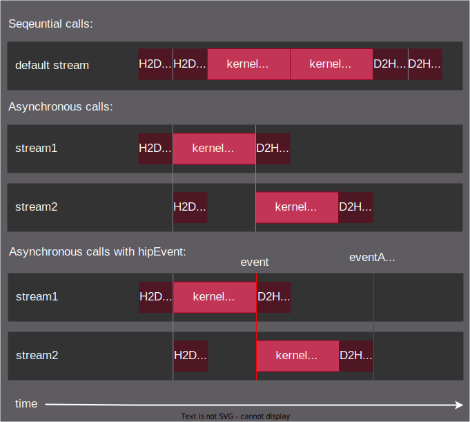

.. meta::
  :description: This topic describes asynchronous concurrent execution in HIP
  :keywords: AMD, ROCm, HIP, asynchronous concurrent execution, asynchronous, async, concurrent, concurrency

.. _asynchronous_how-to:

*******************************************************************************
Asynchronous concurrent execution
*******************************************************************************

Asynchronous concurrent execution is important for efficient parallelism and
resource utilization, with techniques such as overlapping computation and data
transfer, managing concurrent kernel execution with streams on single or
multiple devices, or using HIP graphs.

Streams and concurrent execution
===============================================================================

All asynchronous APIs, such as kernel execution, data movement and potentially
data allocation/freeing all happen in the context of device streams.

Streams are FIFO buffers of commands to execute in order on a given device.
Commands which enqueue tasks on a stream all return promptly and the task is
executed asynchronously. Multiple streams can point to the same device and
those streams might be fed from multiple concurrent host-side threads. Multiple
streams tied to the same device are not guaranteed to execute their commands in
order.

Managing streams
-------------------------------------------------------------------------------

Streams enable the overlap of computation and data transfer, ensuring
continuous GPU activity. By enabling tasks to run concurrently within the same
GPU or across different GPUs, streams improve performance and throughput in
high-performance computing (HPC).

To create a stream, the following functions are used, each defining a handle
to the newly created stream:

- :cpp:func:`hipStreamCreate`: Creates a stream with default settings.
- :cpp:func:`hipStreamCreateWithFlags`: Creates a stream, with specific
  flags, listed below, enabling more control over stream behavior:

  - ``hipStreamDefault``: creates a default stream suitable for most
    operations. The default stream is a blocking operation.
  - ``hipStreamNonBlocking``: creates a non-blocking stream, allowing
    concurrent execution of operations. It ensures that tasks can run
    simultaneously without waiting for each other to complete, thus improving
    overall performance.

- :cpp:func:`hipStreamCreateWithPriority`: Allows creating a stream with a
  specified priority, enabling prioritization of certain tasks.

The :cpp:func:`hipStreamSynchronize` function is used to block the calling host
thread until all previously submitted tasks in a specified HIP stream have
completed. It ensures that all operations in the given stream, such as kernel
executions or memory transfers, are finished before the host thread proceeds.

.. note::

  If the :cpp:func:`hipStreamSynchronize` function input stream is 0 (or the
  default stream), it waits for all operations in the default stream to
  complete.

Concurrent execution between host and device
-------------------------------------------------------------------------------

Concurrent execution between the host (CPU) and device (GPU) allows the CPU to
perform other tasks while the GPU is executing kernels. Kernels are launched
asynchronously using ``hipLaunchKernelGGL`` or using the triple chevron with a stream,
enabling the CPU to continue executing other code while the GPU processes the
kernel. Similarly, memory operations like :cpp:func:`hipMemcpyAsync` are
performed asynchronously, allowing data transfers between the host and device
without blocking the CPU.

Concurrent kernel execution
-------------------------------------------------------------------------------

Concurrent execution of multiple kernels on the GPU allows different kernels to
run simultaneously to maximize GPU resource usage. Managing dependencies
between kernels is crucial for ensuring correct execution order. This can be
achieved using :cpp:func:`hipStreamWaitEvent`, which allows a kernel to wait
for a specific event before starting execution.

Independent kernels can only run concurrently if there are enough registers
and shared memory for the kernels. To enable concurrent kernel executions, the
developer may have to reduce the block size of the kernels. The kernel runtimes
can be misleading for concurrent kernel runs, that is why during optimization
it is a good practice to check the trace files, to see if one kernel is blocking
another kernel, while they are running in parallel. For more information about
application tracing, see :doc:`rocprofiler:how-to/using-rocprof`.

When running kernels in parallel, the execution time can increase due to
contention for shared resources. This is because multiple kernels may attempt
to access the same GPU resources simultaneously, leading to delays.

Multiple kernels executing concurrently is only beneficial under specific conditions. It
is most effective when the kernels do not fully utilize the GPU's resources. In
such cases, overlapping kernel execution can improve overall throughput and
efficiency by keeping the GPU busy without exceeding its capacity.

Overlap of data transfer and kernel execution
===============================================================================

One of the primary benefits of asynchronous operations and multiple streams is
the ability to overlap data transfer with kernel execution, leading to better
resource utilization and improved performance.

Asynchronous execution is particularly advantageous in iterative processes. For
instance, if a kernel is initiated, it can be efficient to prepare the input
data simultaneously, provided that this preparation does not depend on the
kernel's execution. Such iterative data transfer and kernel execution overlap
can be find in the :ref:`async_example`.

Querying device capabilities
-------------------------------------------------------------------------------

Some AMD HIP-enabled devices can perform asynchronous memory copy operations to
or from the GPU concurrently with kernel execution. Applications can query this
capability by checking the ``asyncEngineCount`` device property. Devices with
an ``asyncEngineCount`` greater than zero support concurrent data transfers.
Additionally, if host memory is involved in the copy, it should be page-locked
to ensure optimal performance. Page-locking (or pinning) host memory increases
the bandwidth between the host and the device, reducing the overhead associated
with data transfers. For more details, visit :ref:`host_memory` page.

Asynchronous memory operations
-------------------------------------------------------------------------------

Asynchronous memory operations do not block the host while copying data and,
when used with multiple streams, allow data to be transferred between the host
and device while kernels are executed on the same GPU. Using operations like
:cpp:func:`hipMemcpyAsync` or :cpp:func:`hipMemcpyPeerAsync`, developers can
initiate data transfers without waiting for the previous operation to complete.
This overlap of computation and data transfer ensures that the GPU is not idle
while waiting for data. :cpp:func:`hipMemcpyPeerAsync` enables data transfers
between different GPUs, facilitating multi-GPU communication.

:ref:`async_example` include launching kernels in one stream while performing
data transfers in another. This technique is especially useful in applications
with large data sets that need to be processed quickly.

Concurrent data transfers with intra-device copies
-------------------------------------------------------------------------------

Devices that support the ``concurrentKernels`` property can perform
intra-device copies concurrently with kernel execution. Additionally, devices
that support the ``asyncEngineCount`` property can perform data transfers to
or from the GPU simultaneously with kernel execution. Intra-device copies can
be initiated using standard memory copy functions with destination and source
addresses residing on the same device.

Synchronization, event management and synchronous calls
===============================================================================

Synchronization and event management are important for coordinating tasks and
ensuring correct execution order, and synchronous calls are necessary for
maintaining data consistency.

Synchronous calls
-------------------------------------------------------------------------------

Synchronous calls ensure task completion before moving to the next operation.
For example, :cpp:func:`hipMemcpy` for data transfers waits for completion
before returning control to the host. Similarly, synchronous kernel launches
are used when immediate completion is required. When a synchronous function is
called, control is not returned to the host thread before the device has
completed the requested task. The behavior of the host thread—whether to yield,
block, or spin—can be specified using :cpp:func:`hipSetDeviceFlags` with
appropriate flags. Understanding when to use synchronous calls is important for
managing execution flow and avoiding data races.

Events for synchronization
-------------------------------------------------------------------------------

By creating an event with :cpp:func:`hipEventCreate` and recording it with
:cpp:func:`hipEventRecord`, developers can synchronize operations across
streams, ensuring correct task execution order. :cpp:func:`hipEventSynchronize`
lets the application wait for an event to complete before proceeding with the next
operation.

Programmatic dependent launch and synchronization
-------------------------------------------------------------------------------

While CUDA supports programmatic dependent launches allowing a secondary kernel
to start before the primary kernel finishes, HIP achieves similar functionality
using streams and events. By employing :cpp:func:`hipStreamWaitEvent`, it is
possible to manage the execution order without explicit hardware support. This
mechanism allows a secondary kernel to launch as soon as the necessary
conditions are met, even if the primary kernel is still running.

.. _async_example:

Example
-------------------------------------------------------------------------------

The examples shows the difference between sequential, asynchronous calls and
asynchronous calls with ``hipEvents``.

The example codes

.. tab-set::

    .. tab-item:: Sequential

      .. code-block:: cpp

        #include <hip/hip_runtime.h>
        #include <vector>
        #include <iostream>

        #define HIP_CHECK(expression)                \
        {                                            \
            const hipError_t status = expression;    \
            if(status != hipSuccess){                \
                    std::cerr << "HIP error "        \
                        << status << ": "            \
                        << hipGetErrorString(status) \
                        << " at " << __FILE__ << ":" \
                        << __LINE__ << std::endl;    \
            }                                        \
        }

        // GPU Kernels
        __global__ void kernelA(double* arrayA, size_t size){
            const size_t x = threadIdx.x + blockDim.x * blockIdx.x;
            if(x < size){arrayA[x] += 1.0;}
        };
        __global__ void kernelB(double* arrayA, double* arrayB, size_t size){
            const size_t x = threadIdx.x + blockDim.x * blockIdx.x;
            if(x < size){arrayB[x] += arrayA[x] + 3.0;}
        };

        int main()
        {
            constexpr int numOfBlocks = 1 << 20;
            constexpr int threadsPerBlock = 1024;
            constexpr int numberOfIterations = 50;
            // The array size smaller to avoid the relatively short kernel launch compared to memory copies
            constexpr size_t arraySize = 1U << 25;
            double *d_dataA;
            double *d_dataB;

            double initValueA = 0.0;
            double initValueB = 2.0;

            std::vector<double> vectorA(arraySize, initValueA);
            std::vector<double> vectorB(arraySize, initValueB);
            // Allocate device memory
            HIP_CHECK(hipMalloc(&d_dataA, arraySize * sizeof(*d_dataA)));
            HIP_CHECK(hipMalloc(&d_dataB, arraySize * sizeof(*d_dataB)));
            for(int iteration = 0; iteration < numberOfIterations; iteration++)
            {
                // Host to Device copies
                HIP_CHECK(hipMemcpy(d_dataA, vectorA.data(), arraySize * sizeof(*d_dataA), hipMemcpyHostToDevice));
                HIP_CHECK(hipMemcpy(d_dataB, vectorB.data(), arraySize * sizeof(*d_dataB), hipMemcpyHostToDevice));
                // Launch the GPU kernels
                hipLaunchKernelGGL(kernelA, dim3(numOfBlocks), dim3(threadsPerBlock), 0, 0, d_dataA, arraySize);
                hipLaunchKernelGGL(kernelB, dim3(numOfBlocks), dim3(threadsPerBlock), 0, 0, d_dataA, d_dataB, arraySize);
                // Device to Host copies
                HIP_CHECK(hipMemcpy(vectorA.data(), d_dataA, arraySize * sizeof(*vectorA.data()), hipMemcpyDeviceToHost));
                HIP_CHECK(hipMemcpy(vectorB.data(), d_dataB, arraySize * sizeof(*vectorB.data()), hipMemcpyDeviceToHost));
            }
            // Wait for all operations to complete
            HIP_CHECK(hipDeviceSynchronize());

            // Verify results
            const double expectedA = (double)numberOfIterations;
            const double expectedB =
                initValueB + (3.0 * numberOfIterations) +
                (expectedA * (expectedA + 1.0)) / 2.0;
            bool passed = true;
            for(size_t i = 0; i < arraySize; ++i){
                if(vectorA[i] != expectedA){
                    passed = false;
                    std::cerr << "Validation failed! Expected " << expectedA << " got " << vectorA[i] << " at index: " << i << std::endl;
                    break;
                }
                if(vectorB[i] != expectedB){
                    passed = false;
                    std::cerr << "Validation failed! Expected " << expectedB << " got " <<  vectorB[i] << " at index: " << i << std::endl;
                    break;
                }
            }

            if(passed){
                std::cout << "Sequential execution completed successfully." << std::endl;
            }else{
                std::cerr << "Sequential execution failed." << std::endl;
            }

            // Cleanup
            HIP_CHECK(hipFree(d_dataA));
            HIP_CHECK(hipFree(d_dataB));

            return 0;
        }

    .. tab-item:: Asynchronous

      .. code-block:: cpp

        #include <hip/hip_runtime.h>
        #include <vector>
        #include <iostream>

        #define HIP_CHECK(expression)                \
        {                                            \
            const hipError_t status = expression;    \
            if(status != hipSuccess){                \
                    std::cerr << "HIP error "        \
                        << status << ": "            \
                        << hipGetErrorString(status) \
                        << " at " << __FILE__ << ":" \
                        << __LINE__ << std::endl;    \
            }                                        \
        }

        // GPU Kernels
        __global__ void kernelA(double* arrayA, size_t size){
            const size_t x = threadIdx.x + blockDim.x * blockIdx.x;
            if(x < size){arrayA[x] += 1.0;}
        };
        __global__ void kernelB(double* arrayA, double* arrayB, size_t size){
            const size_t x = threadIdx.x + blockDim.x * blockIdx.x;
            if(x < size){arrayB[x] += arrayA[x] + 3.0;}
        };

        int main()
        {
            constexpr int numOfBlocks = 1 << 20;
            constexpr int threadsPerBlock = 1024;
            constexpr int numberOfIterations = 50;
            // The array size smaller to avoid the relatively short kernel launch compared to memory copies
            constexpr size_t arraySize = 1U << 25;
            double *d_dataA;
            double *d_dataB;

            double initValueA = 0.0;
            double initValueB = 2.0;

            std::vector<double> vectorA(arraySize, initValueA);
            std::vector<double> vectorB(arraySize, initValueB);
            // Allocate device memory
            HIP_CHECK(hipMalloc(&d_dataA, arraySize * sizeof(*d_dataA)));
            HIP_CHECK(hipMalloc(&d_dataB, arraySize * sizeof(*d_dataB)));
            // Create streams
            hipStream_t streamA, streamB;
            HIP_CHECK(hipStreamCreate(&streamA));
            HIP_CHECK(hipStreamCreate(&streamB));
            for(unsigned int iteration = 0; iteration < numberOfIterations; iteration++)
            {
                // Stream 1: Host to Device 1
                HIP_CHECK(hipMemcpyAsync(d_dataA, vectorA.data(), arraySize * sizeof(*d_dataA), hipMemcpyHostToDevice, streamA));
                // Stream 2: Host to Device 2
                HIP_CHECK(hipMemcpyAsync(d_dataB, vectorB.data(), arraySize * sizeof(*d_dataB), hipMemcpyHostToDevice, streamB));
                // Stream 1: Kernel 1
                hipLaunchKernelGGL(kernelA, dim3(numOfBlocks), dim3(threadsPerBlock), 0, streamA, d_dataA, arraySize);
                // Wait for streamA finish
                HIP_CHECK(hipStreamSynchronize(streamA));
                // Stream 2: Kernel 2
                hipLaunchKernelGGL(kernelB, dim3(numOfBlocks), dim3(threadsPerBlock), 0, streamB, d_dataA, d_dataB, arraySize);
                // Stream 1: Device to Host 2 (after Kernel 1)
                HIP_CHECK(hipMemcpyAsync(vectorA.data(), d_dataA, arraySize * sizeof(*vectorA.data()), hipMemcpyDeviceToHost, streamA));
                // Stream 2: Device to Host 2 (after Kernel 2)
                HIP_CHECK(hipMemcpyAsync(vectorB.data(), d_dataB, arraySize * sizeof(*vectorB.data()), hipMemcpyDeviceToHost, streamB));
            }
            // Wait for all operations in both streams to complete
            HIP_CHECK(hipStreamSynchronize(streamA));
            HIP_CHECK(hipStreamSynchronize(streamB));
            // Verify results
            double expectedA = (double)numberOfIterations;
            double expectedB =
                initValueB + (3.0 * numberOfIterations) +
                (expectedA * (expectedA + 1.0)) / 2.0;
            bool passed = true;
            for(size_t i = 0; i < arraySize; ++i){
                if(vectorA[i] != expectedA){
                    passed = false;
                    std::cerr << "Validation failed! Expected " << expectedA << " got " << vectorA[i] << " at index: " << i << std::endl;
                    break;
                }
                if(vectorB[i] != expectedB){
                    passed = false;
                    std::cerr << "Validation failed! Expected " << expectedB << " got " <<  vectorB[i] << " at index: " << i << std::endl;
                    break;
                }
            }
            if(passed){
                std::cout << "Asynchronous execution completed successfully." << std::endl;
            }else{
                std::cerr << "Asynchronous execution failed." << std::endl;
            }

            // Cleanup
            HIP_CHECK(hipStreamDestroy(streamA));
            HIP_CHECK(hipStreamDestroy(streamB));
            HIP_CHECK(hipFree(d_dataA));
            HIP_CHECK(hipFree(d_dataB));

            return 0;
        }

    .. tab-item:: hipStreamWaitEvent

      .. code-block:: cpp

        #include <hip/hip_runtime.h>
        #include <vector>
        #include <iostream>

        #define HIP_CHECK(expression)                \
        {                                            \
            const hipError_t status = expression;    \
            if(status != hipSuccess){                \
                    std::cerr << "HIP error "        \
                        << status << ": "            \
                        << hipGetErrorString(status) \
                        << " at " << __FILE__ << ":" \
                        << __LINE__ << std::endl;    \
            }                                        \
        }

        // GPU Kernels
        __global__ void kernelA(double* arrayA, size_t size){
            const size_t x = threadIdx.x + blockDim.x * blockIdx.x;
            if(x < size){arrayA[x] += 1.0;}
        };
        __global__ void kernelB(double* arrayA, double* arrayB, size_t size){
            const size_t x = threadIdx.x + blockDim.x * blockIdx.x;
            if(x < size){arrayB[x] += arrayA[x] + 3.0;}
        };

        int main()
        {
            constexpr int numOfBlocks = 1 << 20;
            constexpr int threadsPerBlock = 1024;
            constexpr int numberOfIterations = 50;
            // The array size smaller to avoid the relatively short kernel launch compared to memory copies
            constexpr size_t arraySize = 1U << 25;
            double *d_dataA;
            double *d_dataB;
            double initValueA = 0.0;
            double initValueB = 2.0;

            std::vector<double> vectorA(arraySize, initValueA);
            std::vector<double> vectorB(arraySize, initValueB);
            // Allocate device memory
            HIP_CHECK(hipMalloc(&d_dataA, arraySize * sizeof(*d_dataA)));
            HIP_CHECK(hipMalloc(&d_dataB, arraySize * sizeof(*d_dataB)));
            // Create streams
            hipStream_t streamA, streamB;
            HIP_CHECK(hipStreamCreate(&streamA));
            HIP_CHECK(hipStreamCreate(&streamB));
            // Create events
            hipEvent_t event, eventA, eventB;
            HIP_CHECK(hipEventCreate(&event));
            HIP_CHECK(hipEventCreate(&eventA));
            HIP_CHECK(hipEventCreate(&eventB));
            for(unsigned int iteration = 0; iteration < numberOfIterations; iteration++)
            {
                // Stream 1: Host to Device 1
                HIP_CHECK(hipMemcpyAsync(d_dataA, vectorA.data(), arraySize * sizeof(*d_dataA), hipMemcpyHostToDevice, streamA));
                // Stream 2: Host to Device 2
                HIP_CHECK(hipMemcpyAsync(d_dataB, vectorB.data(), arraySize * sizeof(*d_dataB), hipMemcpyHostToDevice, streamB));
                // Stream 1: Kernel 1
                hipLaunchKernelGGL(kernelA, dim3(numOfBlocks), dim3(threadsPerBlock), 0, streamA, d_dataA, arraySize);
                // Record event after the GPU kernel in Stream 1
                HIP_CHECK(hipEventRecord(event, streamA));
                // Stream 2: Wait for event before starting Kernel 2
                HIP_CHECK(hipStreamWaitEvent(streamB, event, 0));
                // Stream 2: Kernel 2
                hipLaunchKernelGGL(kernelB, dim3(numOfBlocks), dim3(threadsPerBlock), 0, streamB, d_dataA, d_dataB, arraySize);
                // Stream 1: Device to Host 2 (after Kernel 1)
                HIP_CHECK(hipMemcpyAsync(vectorA.data(), d_dataA, arraySize * sizeof(*vectorA.data()), hipMemcpyDeviceToHost, streamA));
                // Stream 2: Device to Host 2 (after Kernel 2)
                HIP_CHECK(hipMemcpyAsync(vectorB.data(), d_dataB, arraySize * sizeof(*vectorB.data()), hipMemcpyDeviceToHost, streamB));
                // Wait for all operations in both streams to complete
                HIP_CHECK(hipEventRecord(eventA, streamA));
                HIP_CHECK(hipEventRecord(eventB, streamB));
                HIP_CHECK(hipStreamWaitEvent(streamA, eventA, 0));
                HIP_CHECK(hipStreamWaitEvent(streamB, eventB, 0));
            }
            // Verify results
            double expectedA = (double)numberOfIterations;
            double expectedB =
                initValueB + (3.0 * numberOfIterations) +
                (expectedA * (expectedA + 1.0)) / 2.0;
            bool passed = true;
            for(size_t i = 0; i < arraySize; ++i){
                if(vectorA[i] != expectedA){
                    passed = false;
                    std::cerr << "Validation failed! Expected " << expectedA << " got " << vectorA[i] << std::endl;
                    break;
                }
                if(vectorB[i] != expectedB){
                    passed = false;
                    std::cerr << "Validation failed! Expected " << expectedB << " got " <<  vectorB[i] << std::endl;
                    break;
                }
            }
            if(passed){
                std::cout << "Asynchronous execution with events completed successfully." << std::endl;
            }else{
                std::cerr << "Asynchronous execution with events failed." << std::endl;
            }

            // Cleanup
            HIP_CHECK(hipEventDestroy(event));
            HIP_CHECK(hipEventDestroy(eventA));
            HIP_CHECK(hipEventDestroy(eventB));
            HIP_CHECK(hipStreamDestroy(streamA));
            HIP_CHECK(hipStreamDestroy(streamB));
            HIP_CHECK(hipFree(d_dataA));
            HIP_CHECK(hipFree(d_dataB));

            return 0;
        }

HIP Graphs
===============================================================================

HIP graphs offer an efficient alternative to the standard method of launching
GPU tasks via streams. Comprising nodes for operations and edges for
dependencies, HIP graphs reduce kernel launch overhead and provide a high-level
abstraction for managing dependencies and synchronization. By representing
sequences of kernels and memory operations as a single graph, they simplify
complex workflows and enhance performance, particularly for applications with
intricate dependencies and multiple execution stages.
For more details, see the :ref:`how_to_HIP_graph` documentation.
