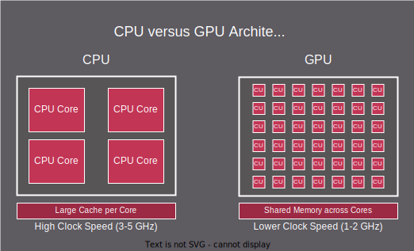
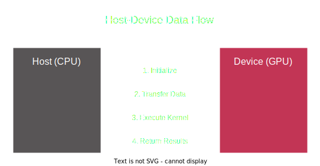
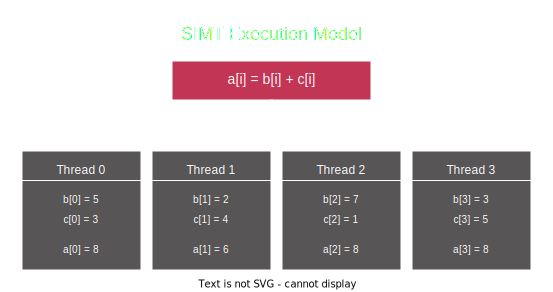
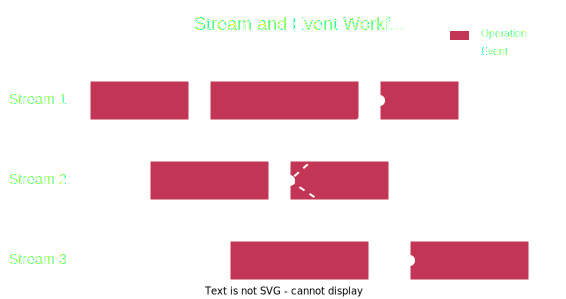

.. meta::
  :description: This chapter explains the HIP programming model, the contract
                between the programmer and the compiler/runtime executing the
                code, how it maps to the hardware.
  :keywords: ROCm, HIP, CUDA, API design, programming model

.. _programming_model:

*******************************************************************************
Introduction to the HIP programming model
*******************************************************************************

The HIP programming model enables mapping data-parallel C/C++ algorithms to massively
parallel SIMD (Single Instruction, Multiple Data) architectures like GPUs. HIP
supports many imperative languages, such as Python via PyHIP, but this document
focuses on the original C/C++ API of HIP.

While GPUs may be capable of running applications written for CPUs if properly ported
and compiled, it would not be an efficient use of GPU resources. GPUs fundamentally differ
from CPUs and should be used accordingly to achieve optimum
performance. A basic understanding of the underlying device architecture helps you
make efficient use of HIP and general purpose graphics processing unit (GPGPU)
programming in general. The following topics introduce you to the key concepts of 
GPU-based programming and the HIP programming model. 

Hardware differences: CPU vs GPU
================================

CPUs and GPUs have been designed for different purposes. CPUs quickly execute a single thread, decreasing the time for a single operation while increasing the number of sequential instructions that can be executed. This includes fetching data and reducing pipeline stalls where the ALU has to wait for previous instructions to finish. 

        The CPU block shows four large processing cores, lists Large Cache per
        Core, and High Clock Speed of 3 to 5 gigahertz. The GPU block shows 42
        smaller processing cores, lists Shared Memory across Cores, and Lower
        Clock Speeds of 1 to 2 gigahertz.  

  Differences in CPUs and GPUs

With CPUs, the goal is to quickly process operations. CPUs provide low-latency processing for
serial instructions. On the other hand, GPUs have been designed to execute many similar commands, or threads,
in parallel, achieving higher throughput. Latency is the time between starting an
operation and receiving its result, such as 2 ns, while throughput is the rate of
completed operations, for example, operations per second.

For the GPU, the objective is to process as many operations in parallel, rather
than to finish a single instruction quickly. GPUs in general are made up of basic
building blocks called compute units (CUs), that execute the threads of a kernel.
As described in :ref:`hardware_implementation`, these CUs provide the necessary
resources for the threads: the Arithmetic Logical Units (ALUs), register files,
caches and shared memory for efficient communication between the threads.

The following describes a few hardware differences between CPUs and GPUs: 

* CPU:

  - Optimized for sequential processing with a few powerful cores (4-64 typically)
  - High clock speeds (3-5 GHz)
  - One register file per thread. On modern CPUs you have at most 2 register files per core, called hyperthreading.
  - One ALU executing the thread.

    - Designed to quickly execute instructions of the same thread.
    - Complex branch prediction.

  - Large L1/L2 cache per core, shared by fewer threads (maximum of 2 when hyperthreading is available).
  - A disadvantage is switching execution from one thread to another (or context switching) takes a considerable amount of time: the ALU pipeline needs to be emptied, the register file has to be written to memory to free the register for another thread.
 
* GPU:

  - Designed for parallel processing with many simpler cores (hundreds/thousands)
  - Lower clock speeds (1-2 GHz)
  - Streamlined control logic
  - Small caches, more registers
  - Register files are shared among threads. The number of threads that can be run in parallel depends on the registers needed per thread.
  - Multiple ALUs execute a collection of threads having the same operations, also known as a wavefront or warp. This is called single-instruction, multiple threads (SIMT) operation as described in :ref:`programming_model_simt`. 

    - The collection of ALUs is called SIMD. SIMDs are an extension to the hardware architecture that allows a `single instruction` to concurrently operate on `multiple data` inputs. 
    - For branching threads where conditional instructions lead to thread divergence, ALUs still process the full wavefront, but the result for divergent threads is masked out. This leads to wasted ALU cycles and should be a consideration in your programming. Keep instructions consistent and leave conditionals out of threads.

  - The advantage for GPUs is that context switching is easy. All threads that run on a core/compute unit have their registers on the compute unit, so they don't need to be stored to global memory, and each cycle one instruction from any wavefront that resides on the compute unit can be issued.

When programming for a heterogeneous system, which incorporates CPUs and GPUs, you must
write your program to take advantage of the strengths of the available hardware.
Use the CPU for tasks that require complex logic with conditional branching, to reduce the
time to reach a decision. Use the GPU for parallel operations of the same instruction
across large datasets, with little branching, where the volume of operations is the key.  

.. _heterogeneous_programming:

Heterogeneous programming
=========================

The HIP programming model has two execution contexts. The main application starts on the CPU, or
the *host* processor, and compute kernels are launched on the *device* such as `Instinct
accelerators <https://www.amd.com/en/products/accelerators/instinct.html>`_ or AMD GPUs.
The host execution is defined by the C++ abstract machine, while device execution
follows the :ref:`SIMT model<programming_model_simt>` of HIP. These two execution contexts
are signified by the ``__host__`` and ``__global__``  (or ``__device__``) decorators
in HIP program code. There are a few key differences between the two contexts:

* The C++ abstract machine assumes a unified memory address space, meaning that
  one can always access any given address in memory (assuming the absence of
  data races). HIP however introduces several memory namespaces, an address
  from one means nothing in another. Moreover, not all address spaces are
  accessible from all contexts.

  Looking at the :ref:`gcn_cu` figure, you can see that every CU has an instance of storage
  backing the namespace ``__shared__``. Even if the host were to have access to these
  regions of memory, the performance benefits of the segmented memory subsystem are
  supported by the inability of asynchronous access from the host.

* Not all C++ language features map cleanly to typical GPU device architectures.
  Some C++ features have poor latency when implemented on GPU devices, therefore
  they are forbidden in device contexts to avoid using features that unexpectedly
  decimate the program's performance. Offload devices targeted by HIP aren't general
  purpose devices, at least not in the sense that a CPU is. HIP focuses on data
  parallel computations and as such caters to throughput optimized architectures,
  such as GPUs or accelerators derived from GPU architectures.

* Asynchronicity is at the forefront of the HIP API. Computations launched on the device
  execute asynchronously with respect to the host, and it is the user's responsibility to
  synchronize their data dispatch/fetch with computations on the device.

  .. note::
    HIP performs implicit synchronization on occasions, unlike some
    APIs where the responsibility for synchronization is left to the user.

Host programming
----------------

In heterogeneous programming, the CPU is available for processing operations but the host application has the additional task of managing data and computation exchanges between the CPU (host) and GPU (device). The host acts as the application manager, coordinating the overall workflow and directing operations to the appropriate context, handles data preparation and data transfers, and manages GPU tasks and synchronization. Here is a typical sequence of operations:

1.	Initialize the HIP runtime and select the GPU: As described in :ref:`initialization`, refers to identifying and selecting a target GPU, setting up a context to let the CPU interact with the GPU.  
2.	Data preparation: As discussed in :ref:`memory_management`, this includes allocating the required memory on the host and device, preparing input data and transferring it from the host to the device. The data is both transferred to the device, and passed as an input parameter when launching the kernel. 
3.	Configure and launch the kernel on the GPU: As described in :ref:`device_program`, this defines kernel configurations and arguments, launches kernel to run on the GPU device using the triple chevron syntax or appropriate API call (for example ``hipLaunchKernelGGL``). On the GPU, multiple kernels can run on streams, with a queue of operations. Within the same stream, operations run in the order they were issued, but on multiple streams operations are independent and can execute concurrently. In the HIP runtime, kernels run on the default stream when one is not specified, but specifying a stream for the kernel lets you increase concurrency in task scheduling and resource utilization, and launch and manage multiple kernels from the host program.
4.	Synchronization: As described in :ref:`asynchronous_how-to`, kernel execution occurs in the context of device streams, specifically the default (`0`) stream. You can use streams and events to manage task dependencies, overlap computation with data transfers, and manage asynchronous processes to ensure proper sequencing of operations. Wait for events or streams to finish execution and transfer results from the GPU back to the host.
5.	Error handling: As described in :ref:`error_handling`, you should catch and handle potential errors from API calls, kernel launches, or memory operations. For example, use ``hipGetErrorString`` to retrieve error messages.
6.	Cleanup and resource management: Validate results, clean up GPU contexts and resources, and free allocated memory on the host and devices.

This structure allows for efficient use of GPU resources and facilitates the acceleration of compute-intensive tasks while keeping the host CPU available for other tasks.

        There are arrows pointing between the rectangles showing from the Host
        to the Device the initialization, data transfer, and Kernel execution
        steps, and from the Device back to the Host the returning results. 

  Interaction of Host and Device in a GPU application

.. _device_program:

Device programming
------------------

The device or kernel program acts as workers on the GPU application, distributing operations to be handled quickly and efficiently. Launching a kernel in the host application starts the kernel program running on the GPU, defining the parallel operations to repeat the same instructions across many datasets. Understanding how the kernel works and the processes involved is essential to writing efficient GPU applications. Threads, blocks, and grids provide a hierarchical approach to parallel operations. Understanding the thread hierarchy is critical to distributing work across the available CUs, managing parallel operations, and optimizing memory access. The general flow of the kernel program looks like this:

1.	Thread Grouping: As described in :ref:`inherent_thread_model`, threads are organized into a hierarchy consisting of threads, which are individual instances of parallel operations, blocks that group the threads, and grids that group blocks into the kernel. Each thread runs an instance of the kernel in parallel with other threads in the block. 
2.	Indexing: The kernel computes the unique index for each thread to access the relevant data to be processed by the thread.  
3.	Data Fetch: Threads fetch input data from memory previously transferred from the host to the device. As described in :ref:`memory_hierarchy`, the hierarchy of threads is influenced by the memory subsystem of GPUs. The memory hierarchy includes local memory per-thread with very fast access, shared memory for the block of threads which also supports quick access, and larger amounts of global memory visible to the whole kernel,but accesses are expensive due to high latency. Understanding the memory model is a key concept for kernel programming.
4.	Computation: Threads perform the required computations on the input data, and generate any needed output. Each thread of the kernel runs the same instruction simultaneously on the different datasets. This sometimes require multiple iterations when the number of operations exceeds the resources of the CU. 
5.	Synchronization: When needed, threads synchronize within their block to ensure correct results when working with shared memory.

Kernels are parallel programs that execute the same instruction set across multiple threads, organized in wavefronts, as described below and as demonstrated in the `Hello World tutorial <https://github.com/ROCm/rocm-examples/tree/develop/HIP-Basic/hello_world>`_ or :doc:`../tutorial/saxpy`. However, heterogeneous GPU applications can also become quite complex, managing hundreds, thousands, or hundreds of thousands of operations with repeated data transfers between host and device to support massive parallelization, using multiple streams to manage concurrent asynchronous operations, using rich libraries of functions optimized for GPU hardware as described in the `ROCm documentation <https://rocm.docs.amd.com/en/latest/>`_. 

.. _programming_model_simt:

Single instruction multiple threads (SIMT)
==========================================

The HIP kernel code, written as a series of scalar instructions for multiple
threads with different thread indices, gets mapped to the SIMD units of the GPUs.
Every single instruction, which is executed for every participating thread of a
kernel, gets mapped to the SIMD.

This is done by grouping threads into warps, which contain as many threads as there
are physical lanes in a SIMD, and issuing that instruction to the SIMD for every
warp of a kernel. Ideally, the SIMD is always fully utilized. However, if the number of threads
can't be evenly divided by the warpSize, then the unused lanes are masked out
from the corresponding SIMD execution.

.. _simt:

        which contains the expression a[i] = b[i] + c[i], and below that four
        arrows that point to Thread 0,1,2, and 3. Each thread contains different
        values for b, c, and a, showing the parallel operations of this equation. 

  Instruction flow of a sample SIMT program

A kernel follows the same C++ rules as the functions on the host, but it has a special ``__global__`` label to mark it for execution on the device, as shown in the following example:

.. code-block:: cpp

  __global__ void AddKernel(float* a, const float* b)
  {
    int global_idx = threadIdx.x + blockIdx.x * blockDim.x;

    a[global_idx] += b[global_idx];
  }

One of the first things you might notice is the usage of the special ``threadIdx``,
``blockIdx`` and ``blockDim`` variables. Unlike normal C++ host functions, a kernel
is not launched once, but as often as specified by the user. Each of these instances
is a separate thread, with its own values for ``threadIdx``, ``blockIdx`` and ``blockDim``.

The kernel program is launched from the host application using a language extension
called the triple chevron syntax, which looks like the following: 

.. code-block:: cpp

  AddKernel<<<number_of_blocks, threads_per_block>>>(a, b);

Inside the angle brackets, provide the following:

* The number of blocks to launch, which defines the grid size (relating to blockDim). 
* The number of threads in a block, which defines the block size (relating to blockIdx). 
* The amount of shared memory to allocate by the host, not specified above.
* The device stream to enqueue the operation on, not specified above so the default stream is used. 

.. note::
  The kernel can also be launched through other methods, such as the ``hipLaunchKernel()`` function. 

Here, the total number of threads launched for the ``AddKernel`` program is defined by
``number_of_blocks *  threads_per_block``. You define these values when launching the
kernel program to address the problem to be solved with the available resources within
the system. In other words, the thread configuration is customized to the needs of the
operations and the available hardware. 

For comparison, the ``AddKernel`` program could be written in plain C++ as a ``FOR`` loop:

.. code-block:: cpp

  for(int i = 0; i < (number_of_blocks * threads_per_block); ++i){
    a[i] += b[i];
  }

In HIP, lanes of the SIMD architecture are fed by mapping threads of a SIMT
execution, one thread down each lane of an SIMD engine. Execution parallelism
usually isn't exploited from the width of the built-in vector types, but across
multiple threads via the thread ID constants ``threadIdx.x``, ``blockIdx.x``, etc.

.. _inherent_thread_model:

Hierarchical thread model
-------------------------

As previously discussed, all threads of a kernel are uniquely identified by a set
of integral values called thread IDs. The hierarchy consists of three levels: thread,
blocks, and grids.

* Threads are single instances of kernel operations, running concurrently across warps
* Blocks group threads together and enable cooperation and shared memory
* Grids define the number of thread blocks for a single kernel launch
* Blocks and grids can be defined in 3 dimensions (``x``, ``y``, ``z``)
* By default, the Y and Z dimensions are set to 1

The combined values represent the thread index, and relate to the sequence that the
threads execute. The thread hierarchy is integral to how AMD GPUs operate, and is
depicted in the following figure.

.. figure:: ../data/understand/programming_model/thread_hierarchy.svg
  :alt: Diagram depicting nested rectangles of varying color. The outermost one
        titled "Grid", inside sets of uniform rectangles layered on one another
        titled "Block". Each "Block" containing sets of uniform rectangles
        layered on one another titled "Warp". Each of the "Warp" titled
        rectangles filled with downward pointing arrows inside.

  Hierarchy of thread groups.

.. _wavefront:

Warp (or Wavefront)
  The innermost grouping of threads is called a warp. A warp is the most tightly
  coupled groups of threads, both physically and logically. Threads inside a warp
  are executed in lockstep, with each thread executing the same instruction. Threads
  in a warp are also called lanes, and the value identifying them is the lane ID.

  .. tip::

    Lane IDs aren't queried like other thread IDs, but are user-calculated. As a
    consequence, they are only as multidimensional as the user interprets the
    calculated values to be.

  The size of a warp is architecture dependent and always fixed. For AMD GPUs
  the warp is typically 64 threads, though sometimes 32 threads. Warps are
  signified by the set of communication primitives at their disposal, as
  discussed in :ref:`warp-cross-lane`.

.. _inherent_thread_hierarchy_block:

Block
  The next level of the thread hierarchy is called a thread block, or block. The
  defining feature of a block is that all threads in the block have shared memory
  that they can use to share data or synchronize with one another, as described in
  :ref:`memory_hierarchy`.

  The size of a block, or the block dimension, is the user-configurable number of
  threads per block, but is limited by the queryable capabilities of the executing
  hardware. The unique ID of the thread within a block can be 1, 2, or 3-dimensional
  as provided by the HIP API. You can configure the thread block to best represent
  the data associated with the kernel instruction set. 
  
  .. note::
    When linearizing thread IDs within a block, assume the *fast index* is the ``x``
    dimension, followed by the ``y`` and ``z`` dimensions.

.. _inherent_thread_hierarchy_grid:

Grid
  The top-most level of the thread hierarchy is a grid. A grid is the number of blocks
  needed for a single launch of the kernel. The unique ID of each block within
  a grid can be 1, 2, or 3-dimensional, as provided by the API and is queryable
  by every thread within the block.

The three-dimensional thread hierarchy available to a kernel program lends itself to solutions
that align closely to the computational problem. The following are some examples: 

* 1-dimensional: array processing, linear data structures, or sequential data transformation
* 2-dimensional: Image processing, matrix operations, 2 dimensional simulations
* 3-dimensional: Volume rendering, 3D scientific simulations, spatial algorithms

Cooperative groups thread model
-------------------------------

The Cooperative groups API introduces new functions to launch, group, subdivide,
synchronize and identify threads, as well as some predefined group-collective
algorithms.  Cooperative groups let you define your own set of thread groups which
may fit your use-cases better than those defined by the hardware. It relaxes some
restrictions of the :ref:`inherent_thread_model` imposed by the strict 1:1 mapping
of architectural details to the programming model.

.. note::
  The implicit groups defined by kernel launch parameters are still available
  when working with cooperative groups.

For further information, see :doc:`Cooperative groups </how-to/hip_runtime_api/cooperative_groups>`.

.. _memory_hierarchy:

Memory model
============

The GPU memory architecture is designed to support parallel execution across the
thread hierarchy. Understanding the following memory spaces and their relationships
to thread groupings is crucial for efficient GPU programming. The choice of memory
type and access patterns significantly impacts kernel performance. The following figure
summarizes the memory namespaces and how they relate to the various levels of the
threading model. 

.. figure:: ../data/understand/programming_model/memory_hierarchy.svg
  :alt: Diagram depicting nested rectangles of varying color. The outermost one
        titled "Grid", inside it are two identical rectangles titled "Block",
        inside them are ones titled "Local" with multiple "Warp" titled rectangles.
        Blocks have not just Local inside, but also rectangles titled "Shared".
        Inside the Grid is a rectangle titled "Global" with three others inside:
        "Surface", "Texture" (same color) and "Constant" (different color).

  Memory hierarchy.

Local or per-thread memory
  Read-write storage only visible to the threads defining the given variables,
  also called per-thread memory. This is the default memory namespace.
  The size of the blocks for a given kernel, and thereby the number of concurrent
  warps, are limited by local memory usage. This relates to the *occupancy* of the
  CU as described in :doc:`Compute Units <./hardware_implementation>`,
  an important concept in resource usage and performance optimization. 

  Use local memory when the data is specific to a thread, to store variables generated
  by the thread, or to provide register pressure relief for the thread. 

Shared memory
  Read-write storage visible to all the threads in a given block. Use shared memory
  when the data is reused within a thread block, when cross-thread communication
  is needed, or to minimize global memory transactions by using device memory
  whenever possible. 

Global
  Read-write storage visible to all threads in a given grid. There are
  specialized versions of global memory with different usage semantics which
  are typically backed by the same hardware storing global. 

  Use global memory when you have large datasets, are transferring memory between
  the host and the device, and when you are sharing data between thread blocks. 

  Constant
    Read-only storage visible to all threads in a given grid. It is a limited
    segment of global with queryable size. Use constant memory for read-only data
    that is shared across multiple threads, and that has a small data size. 

  Texture
    Read-only storage visible to all threads in a given grid and accessible
    through additional APIs.

  Surface
    A read-write version of texture memory.

Memory optimizations and best practices
---------------------------------------

.. figure:: ../data/understand/programming_model/memory-access.svg
  :alt: Diagram depicting an example memory access pattern for coalesced memory. 
        The diagram has uncoalesced access on the left side, with consecutive
        threads accessing memory in a random pattern. With coalesced access on the
        right showing consecutive threads accessing consecutive memory addresses. 

  Coalesced memory accesses

The following are a few memory access patterns and best practices to improve performance. You can find additional information in :ref:`memory_management` and :doc:`../how-to/performance_guidelines`.

* **Global memory**: Coalescing reduces the number of memory transactions.

  Coalesced memory access in HIP refers to the optimization of memory transactions to maximize throughput when accessing global memory. When a kernel accesses global memory, the memory transactions typically occur in chunks of 32, 64, or 128 bytes, which must be naturally aligned. Coalescing memory accesses means aligning and organizing these accesses so that multiple threads in a warp can combine their memory requests into the fewest possible transactions. If threads access memory in a coalesced manner, meaning consecutive threads read or write consecutive memory locations, the memory controller can merge these accesses into a single transaction. This is crucial because global memory bandwidth is relatively low compared to on-chip bandwidths, and non-optimal memory accesses can significantly impact performance. If all the threads in a warp can access consecutive memory locations, memory access is fully coalesced. 

  To achieve coalesced memory access in HIP, you should:

  1. *Align Data*: Use data types that are naturally aligned and ensure that structures and arrays are aligned properly.
  2. *Optimize Access Patterns*: Arrange memory accesses so that consecutive threads in a warp access consecutive memory locations. For example, if threads access a 2D array, the array and thread block widths should be multiples of the warp size.
  3. *Avoid strided access*: For example array[i * stride] can lead to memory bank conflicts and inefficient access.
  4. *Pad Data*: If necessary, pad data structures to ensure alignment and coalescing.

* **Shared memory**: Avoiding bank conflicts reduces the serialization of memory transactions.

  Shared memory is a small, fast memory region inside the CU. Unlike global memory, shared memory accesses do not require coalescing, but they can suffer from bank conflicts, which are another form of inefficient memory access. Shared memory is divided into multiple memory banks (usually 32 banks on modern GPUs). If multiple threads within a warp try to access different addresses that map to the same memory bank, accesses get serialized, leading to poor performance. To optimize shared memory usage, ensure that consecutive threads access different memory banks. Use padding if necessary to avoid conflicts.

* **Texture memory**: Spatial locality improves caching performance.

  Texture memory is read-only memory optimized for spatial locality and caching rather than coalescing. Texture memory is cached, unlike standard global memory, and it provides optimized access patterns for 2D and spatially local data. Accessing neighboring values results in cache hits, improving performance. Therefore, instead of worrying about coalescing, optimal memory access patterns involve ensuring that threads access spatially adjacent texture elements, and the memory layout aligns well with the 2D caching mechanism.

* **Unified memory**: Structured access reduces the overhead of page migrations.

  Unified memory allows the CPU and GPU to share memory seamlessly, but performance depends on access patterns. Unified memory enables automatic page migration between CPU and GPU memory. However, if different threads access different pages, it can lead to expensive page migrations and slow throughput performance. Accessing unified memory in a structured, warp-friendly manner reduces unnecessary page transfers. Ensure threads access memory in a structured, consecutive manner, minimizing page faults. Prefetch data to the GPU before computation by using ``hipMemPrefetchAsync()``. In addition, using small batch transfers as described below, can reduce unexpected page migrations when using unified memory. 

* **Small batch transfers**: Enable pipelining and improve PCIe bandwidth use.

  Memory transfers between the host and the device can become a major bottleneck if not optimized. One method is to use small batch memory transfers where data is transferred in smaller chunks instead of dealing with large datasets to avoid long blocking operations. Small batch transfers offer better PCIe bandwidth utilization over large data transfers. Small batch transfers offer performance improvement by offering reduced latency with small batches that run asynchronously using ``hipMemcpyAsync()`` as described in :ref:`asynchronous_how-to`, pipelining data transfers and kernel execution using separate streams. Finally, using pinned memory with small batch transfers enables faster DMA transfers without CPU involvement, greatly improving memory transfer performance. 

Execution model
===============

As previously discussed in :ref:`heterogeneous_programming`, HIP programs consist of two distinct scopes:

* The host-side API running on the host processor. 
* The device-side kernels running on GPUs. 

Both the host and the device-side APIs have synchronous and asynchronous functions.

Host-side execution
-------------------

The host-side API dealing with device management and their queries are synchronous.
All asynchronous APIs, such as kernel execution, data movement and potentially data
allocation/freeing all happen in the context of device streams, as described in `Managing streams <../how-to/hip_runtime_api/asynchronous.html#managing-streams>`_.

Streams are FIFO buffers of commands to execute relating to a given device.
Operations that enqueue tasks on a stream all return promptly, and the command is
executed asynchronously. All side effects of a command on a stream are visible
to all subsequent commands on the same stream. Multiple streams may point to
the same device and those streams may be fed from multiple concurrent host-side
threads. Execution on multiple streams may be concurrent but isn't required to
be.

Asynchronous APIs involving a stream all return a stream event, which can be
used to synchronize the execution of multiple streams. A user may enqueue a
barrier onto a stream referencing an event. The barrier will block activity on the
stream until the operation related to the event completes. After the event completes, all
side effects of the operation will be visible to subsequent commands even if those
side effects manifest on different devices.

        multiple streams working together. The diagram shows operations as red
        rectangles, and events as white dots. There are three streams labelled
        Stream 1, 2, and 3. The streams each have multiple operations and events
        that require synchronization between the streams. 

  Multiple stream workflow

Streams also support executing user-defined functions as callbacks on the host.
The stream will not launch subsequent commands until the callback completes.

Device-side execution
---------------------

Kernels may be launched in multiple ways, all with different syntaxes and
intended use cases.

* Using the triple-chevron ``<<<...>>>`` operator on a ``__global__`` annotated
  function.

* Using ``hipLaunchKernelGGL()`` on a ``__global__`` annotated function.

  .. tip::

    This name, by default, is a macro expanding to the triple-chevron syntax. In cases where
    language syntax extensions are undesirable, or where launching templated
    and/or overloaded kernel functions define the
    ``HIP_TEMPLATE_KERNEL_LAUNCH`` preprocessor macro before including the HIP
    headers to turn it into a templated function.

Asynchronous execution
----------------------

Asynchronous operations between the host and the kernel provide a variety of opportunities,
or challenges, for managing synchronization, as described in :ref:`asynchronous_how-to`.
For instance, a basic model would be to launch an asynchronous operation on a kernel
in a stream, create an event to track the operation, continue operations in the host
program, and when the event shows that the asynchronous operation is complete,  synchronize the kernel to return the results. 

However, one of the opportunities of asynchronous operation is the pipelining of operations
between launching kernels and transferring memory. In this case, you would be working
with multiple streams running concurrently, or at least overlapping in some regard,
and managing any dependencies between the streams in the host application. 
The producer-consumer paradigm can be used to convert a sequential program
into parallel operations to improve performance. This process can employ multiple
streams to kick off asynchronous kernels, provide data to the kernels, perform operations,
and return the results for further processing in the host application. 

These asynchronous activities call for stream management strategies. In the case
of the single stream, the only management would be the stream synchronization
when the work was complete. However, with multiple streams you have
overlapping execution of operations and synchronization becomes more complex, as shown
in the variations of the example in `Programmatic dependent launch and synchronization <../how-to/hip_runtime_api/asynchronous.html#programmatic-dependent-launch-and-synchronization>`_.  
You need to manage each stream's activities, evaluate the availability of results, evaluate the critical path of the tasks, allocate resources on the hardware, and manage the execution order.

Multi-GPU and load balancing
----------------------------

For applications requiring additional computational power beyond a single device,
HIP supports utilizing multiple GPUs within a system. Large-scale applications
that need more compute power can use multiple GPUs in the system. This enables
the runtime to distribute workloads across multiple GPUs to balance the load and prevent some GPUs
from being over-utilized while others are idle. 

For more information, see :ref:`multi-device`.
